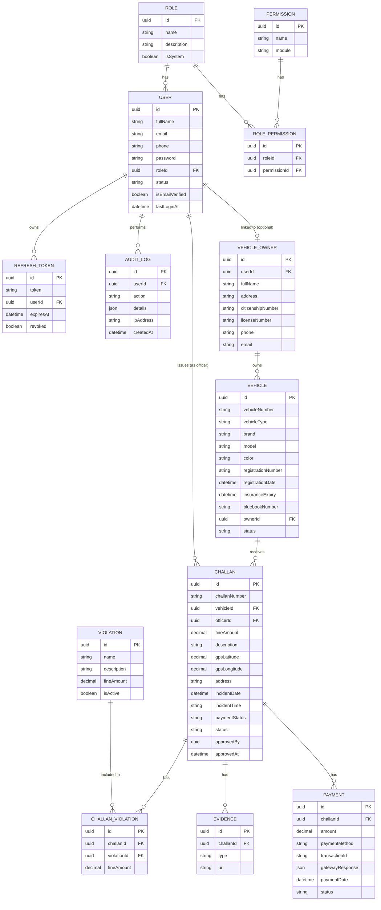

```mermaid
erDiagram
    ROLE ||--o{ USER : "has"
    ROLE ||--o{ ROLE_PERMISSION : "has"
    PERMISSION ||--o{ ROLE_PERMISSION : "has"

    USER ||--o{ REFRESH_TOKEN : "owns"
    USER ||--o{ AUDIT_LOG : "performs"
    USER ||--o| VEHICLE_OWNER : "linked to (optional)"
    USER ||--o{ CHALLAN : "issues (as officer)"

    VEHICLE_OWNER ||--o{ VEHICLE : "owns"
    VEHICLE ||--o{ CHALLAN : "receives"

    VIOLATION ||--o{ CHALLAN_VIOLATION : "included in"
    CHALLAN ||--o{ CHALLAN_VIOLATION : "has"
    CHALLAN ||--o{ EVIDENCE : "has"
    CHALLAN ||--o{ PAYMENT : "has"

    ROLE {
        uuid id PK
        string name
        string description
        boolean isSystem
    }

    PERMISSION {
        uuid id PK
        string name
        string module
    }

    ROLE_PERMISSION {
        uuid id PK
        uuid roleId FK
        uuid permissionId FK
    }

    USER {
        uuid id PK
        string fullName
        string email
        string phone
        string password
        uuid roleId FK
        string status
        boolean isEmailVerified
        datetime lastLoginAt
    }

    REFRESH_TOKEN {
        uuid id PK
        string token
        uuid userId FK
        datetime expiresAt
        boolean revoked
    }

    VEHICLE_OWNER {
        uuid id PK
        uuid userId FK
        string fullName
        string address
        string citizenshipNumber
        string licenseNumber
        string phone
        string email
    }

    VEHICLE {
        uuid id PK
        string vehicleNumber
        string vehicleType
        string brand
        string model
        string color
        string registrationNumber
        datetime registrationDate
        datetime insuranceExpiry
        string bluebookNumber
        uuid ownerId FK
        string status
    }

    VIOLATION {
        uuid id PK
        string name
        string description
        decimal fineAmount
        boolean isActive
    }

    CHALLAN {
        uuid id PK
        string challanNumber
        uuid vehicleId FK
        uuid officerId FK
        decimal fineAmount
        string description
        decimal gpsLatitude
        decimal gpsLongitude
        string address
        datetime incidentDate
        string incidentTime
        string paymentStatus
        string status
        uuid approvedBy
        datetime approvedAt
    }

    CHALLAN_VIOLATION {
        uuid id PK
        uuid challanId FK
        uuid violationId FK
        decimal fineAmount
    }

    EVIDENCE {
        uuid id PK
        uuid challanId FK
        string type
        string url
    }

    PAYMENT {
        uuid id PK
        uuid challanId FK
        decimal amount
        string paymentMethod
        string transactionId
        json gatewayResponse
        datetime paymentDate
        string status
    }

    AUDIT_LOG {
        uuid id PK
        uuid userId FK
        string action
        json details
        string ipAddress
        datetime createdAt
    }
```
